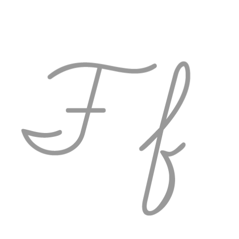

---

<html>
<style>
.links-content{
margin-top:1rem;
}
.link-navigation::after {
content: " ";
display: block;
clear: both;
}
.card {
width: 45%;
font-size: 1rem;
padding: 10px 20px;
border-radius: 4px;
transition-duration: 0.15s;
margin-bottom: 1rem;
display:flex;
}
.card:nth-child(odd) {
float: left;
}
.card:nth-child(even) {
float: right;
}
.card:hover {
transform: scale(1.1);
box-shadow: 0 2px 6px 0 rgba(0, 0, 0, 0.12), 0 0 6px 0 rgba(0, 0, 0, 0.04);
}
.card a {
border:none;
}
.card .ava {
width: 3rem!important;
height: 3rem!important;
margin:0!important;
margin-right: 1em!important;
border-radius:10px;
}
.card .card-header {
overflow: hidden;
width: 100%;
}
.card .card-header .info {
font-style:normal;
color:#a3a3a3;
font-size:14px;
min-width: 0;
overflow: hidden;
white-space: nowrap;
}
</style>
<div class="post-body">
<div id="links">
<div class="links-content">
<a href="https://www.ssnur.com/">
<div class="link-navigation">
<div class="card">

<div class="card-header">
<span>随思南游</span>
<div class="info">生如夏花之绚烂，死如秋叶之静</div>
</div>
</div>
</a>
<a href="https://blog.feizhuqwq.com">
<div class="link-navigation">
<div class="card">

<div class="card-header">
<span>肥猪qwq</span>
<div class="info">因为不可能，所以才值得相信。</div>
</div>
</div>
</a>
<a href="https://www.ecylt.top/">
<div class="link-navigation">
<div class="card">

<div class="card-header">
<span>二次元论坛</span>
<div class="info">按下F逃离世界</div>
</div>
</div>
</a>
<a href="https://loli.fj.cn">
<div class="link-navigation">
<div class="card">

<div class="card-header">
<span>绯鞠的博客</span>
<div class="info">一只爱折腾的绯鞠</div>
</div>
</div>
</a>
<a href="https://springwood.me">
<div class="link-navigation">
<div class="card">

<div class="card-header">
<span>沉舟侧畔Blog</span>
<div class="info">新生的力量，生机勃勃</div>
</div>
</div>
</a>
<a href="https://tinsir888.github.io">
<div class="link-navigation">
<div class="card">

<div class="card-header">
<span>tinsir888's blog</span>
<div class="info">Ηλύσια Πεδία ;-)</div>
</div>
</div>
</a>
</div>
</div>
</div>
</div>
</html>


---

```yaml
- name: Yu's Site
  url: https://blog.loveyou.moe/
  avatar: https://idealistyu.github.io/images/avatar.jpg
  descr: ゆちゃんのブログ
```

欢迎交换友链！请按照相同格式在下方评论中提供贵站的基本信息。

---
